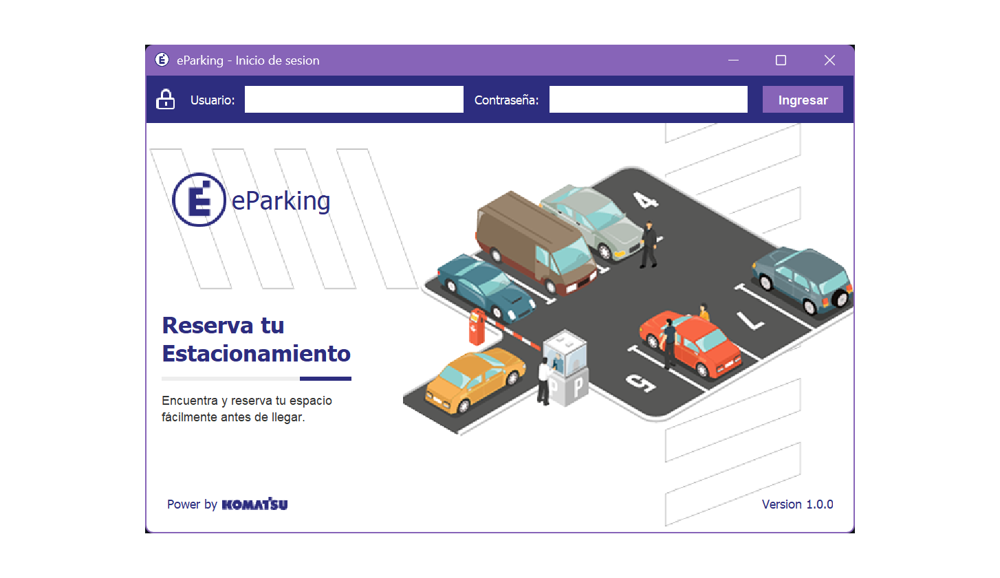

# cibertec2-aed-project

### eParking

Aplicación para la reserva anticipada de espacios de estacionamiento dentro de una empresa cuyo aforo vehicular supera la capacidad disponible.



🔗 [Ver diseño en Figma](https://www.figma.com/design/R7jmfXG34h4ximzVEgNyTq/cibertec2-aed-project?node-id=0-1&t=HrX1DDrkAzDuCUu3-1)

---

## Requisitos

Para ejecutar este proyecto, necesitas tener instalado:

- [JDK 8 o superior](https://www.oracle.com/java/technologies/javase-jdk11-downloads.html)
- Un IDE compatible con proyectos Java (por ejemplo: **NetBeans**, **Eclipse**, **IntelliJ IDEA**)
- Git (opcional, para clonar el repositorio)

---

## Clonar el Repositorio

Puedes clonar este proyecto usando Git desde la terminal o línea de comandos:

```bash
git clone https://github.com/luisangelsalcedo/cibertec2-aed-project.git
```

---
